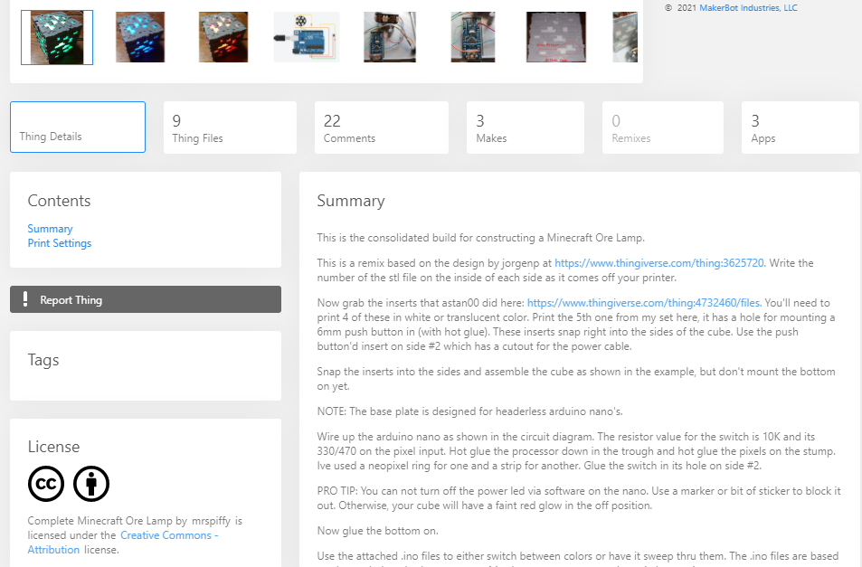
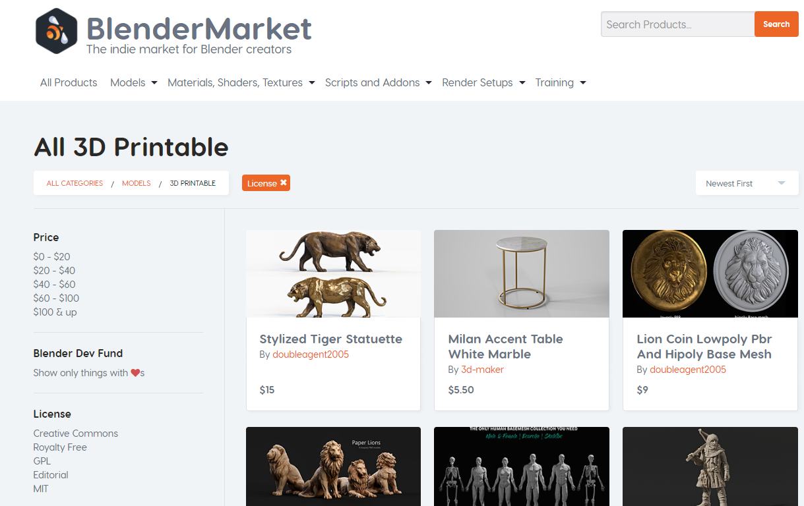

¿Te interesa la impresión 3D? ¿Diseñas tus propios objetos o descargas modelos 3D de internet? ¿Sabes bajo qué licencia están publicados esos modelos?

En este artículo, te hablamos de algunos sitios web donde se pueden encontrar modelos 3D libres. En otro post más adelante hablaremos un poco de Blender, un programa open-source de modelado 3D, con el que poder diseñar nuestros propios proyectos.

## Thingiverse

Seguramente todos los aficionados a la impresión 3D ya conocen [Thingiverse](https://www.thingiverse.com/), uno de los mayores repositorios a nivel mundial, con más de 2 millones de diseños. Es una iniciativa abierta, que anima a sus usuarios a publicar sus creaciones bajo licencias libres: Creative Commons, GPL... Aunque también permite la publicación con licencias privativas.

Es muy sencillo ver bajo qué licencia se ha publicado cada diseño, a la izquierda de su descripción. En este ejemplo podemos ver que el creador permite la distribución, adaptación y modificación, incluso para uso comercial, siempre que se cite al creador original y se distribuya bajo la misma licencia.

Sin embargo, la opción de búsqueda avanzada funciona un poco mal en Thingiverse. Podemos ver que no se encuentra ningún resultado al filtrar por tipo de licencia, aunque ya hemos visto que hay muchos modelos usando Creative Commons - Attribution. Tal vez lo solucionen en el futuro, quién sabe.

## YouMagine

Otra alternativa open-source muy interesante es la web [YouMagine](https://www.youmagine.com/). Aunque más pequeña que Thingiverse (sobre 15000 diseños), es una comunidad comprometida con la publicación libre y la colaboración entre usuarios.

En esta web también es muy sencillo ver el tipo de licencia que se aplica a cada objeto, junto a su descripción. Pero no permite el filtrado por tipo de licencia en la búsqueda.

[En 2015](https://blog.youmagine.com/2015/03/3dpl-released-an-open-source-license-for-3d-printed-things/), YouMagine anunció la creación de la [licencia 3DPL](https://medium.com/@jorispeels/youmagine-3dpl-c11fce097ae), la primera licencia open-source dedidada específicamente a la impresión 3D. Esta licencia cubre ciertas áreas que las licencias open-source tradicionales no consideraban.

Por ejemplo, por defecto permite distribuir y modificar. Opcionalmente, se puede requerir que se imprima el objeto incluyendo el logo del creador original, aunque el objeto sea modificado. O limitar a uso no comercial durante 12 meses, permitiendo la reutilización con fines comerciales tras ese periodo.

## BlenderMarket

Finalmente, otra opción es la web [BlenderMarket](https://blendermarket.com/), que aloja modelos creados por diseñadores con la herramienta open source Blender. Muchos están diseñados para animaciones 3D y videojuegos, pero la página permite filtrar solo los modelos imprimibles, o aquellos con licencias libres.

____________________________

Imagen del banner: [Felix 3D Printer, de Jonathan Juursema. Wikimedia Commons.](https://commons.wikimedia.org/wiki/File:Felix_3D_Printer_-_Printing_Head.JPG)
Imagen del banner: [Felix 3D Printer, de Jonathan Juursema. Wikimedia Commons.](https://commons.wikimedia.org/wiki/File:Felix_3D_Printer_-_Printing_Head.JPG)
