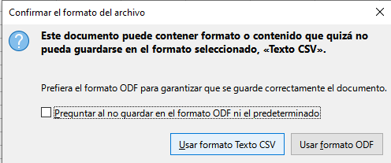
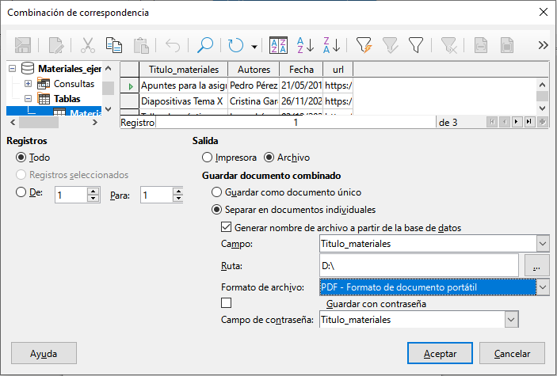
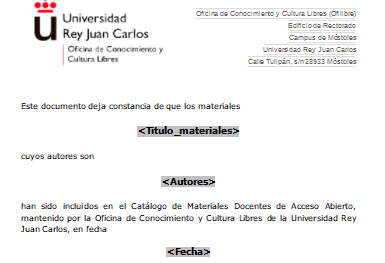

En ocasiones, podemos necesitar escribir un documento genérico para enviar a personas distintas, como una carta, mail o certificado. Tal vez queremos que el documento solo cambie en algunos puntos con datos personales, como puede ser el nombre o la dirección de cada persona. Por simplificar, a menudo se opta por hacer esto manualmente, rellenándolos uno a uno; pero esto supone invertir mucho tiempo si la lista de destinatarios es muy grande. Desde la OfiLibre os queremos mostrar cómo automatizar este proceso utilizando la herramienta [Mail Merge](https://documentation.libreoffice.org/assets/Uploads/Documentation/en/WG4.2/PDF/WG4211-UsingMailMerge.pdf) de LibreOffice Writer. 

[LibreOffice](https://es.libreoffice.org) es un completo paquete ofimático que se distribuye como software libre. Tiene las herrameientas habituales en cualquier otro paquete ofimático. Cuenta con un procesador de textos (Writer), hojas de cálculo (Calc), editor de presentaciones (Impress), una aplicación de dibujo y diagramas de flujo (Draw), una interfaz para bases de datos (Base) y un editor de fórmulas matemáticas (Math). Es compatible con múltiples formatos de documento, incluidos los de Microsoft Word y Excel.

[Aquí podéis descargar LibreOffice de forma completamente gratuita.](https://es.libreoffice.org/descarga/libreoffice/)

## El proceso

Para explicar cómo automatizar la creación de documentos, vamos a poner un ejemplo paso a paso. 
A continuación os mostramos cómo generamos una serie de certificados en la OfiLibre, empleando dos programas: [LibreOffice Calc](https://es.libreoffice.org/descubre/calc/), y [LibreOffice Writer](https://es.libreoffice.org/descubre/writer).

- **El primer paso es guardar todos los datos personales en un documento CSV**. Esto se puede hacer manualmente, escribiendo una hoja de cálculo con la aplicación Calc. También se puede utilizar una base de datos ya existente u otras maneras de automatizar la recolección de datos. En la OfiLibre empleamos [un script de Python](https://gitlab.etsit.urjc.es/ofilibre/code/-/blob/master/parse_catalog/parse_catalog.py) que extrae esta información de una serie de fichas YAML contenidas dentro de documentos Markdown.

- En este tutorial, vamos a **crear manualmente la hoja de cálculo**. La primera línea debe contener el nombre genérico de los atributos, y cada línea siguiente los valores para cada individuo. En esta captura se puede ver cómo lo hemos hecho nosotros:

- A continuación, **guardamos esta información con formato .csv** (valores separados por comas). Para ello, seleccionamos el menú *Archivo > Guardar cómo* y en el desplegable elegimos el formato *Texto CSV*. La primera vez que guardamos como CSV, puede aparecernos el siguiente mensaje de aviso:

- Elegimos seguir guardando en CSV y podemos seleccionar que no vuelva a preguntarnos esto. Después se nos pedirá elegir la codificación del documento. Para que se conserven correctamente las letras españolas como la Ñ o las vocales con tilde, elegiremos "Europa occidental (ISO-8859-1)" y damos a 'Aceptar'.

- A continuación, vamos a **escribir el modelo del documento en Writer**. Escribimos el texto genérico de la carta o certificado, dejando un par de espacios donde vayamos a insertar los nombres personales y otros atributos. Podemos insertar imágenes y dar formato, como de costumbre en cualquier documento.

- Para **importar el fichero CSV**, seleccionamos en Writer el menú *Archivo > Asistentes > Origen de datos de direcciones* y seguimos los pasos del asistente. Como veremos, también podemos usar este asistente para importar datos desde una multitud de fuentes distintas. Seleccionamos *Otro origen de datos externo*, avanzamos y abrimos *Configuración*. Seleccionamos que la fuente es una *Hoja de cálculo*, buscamos la ruta de nuestro fichero .csv ya creado, y probamos la conexión. Al tratarse de una hoja de cálculo, no será necesario asignar los campos.

- Para **ver las tablas de origen** ya en Writer, vamos a **Ver > Orígenes de datos**. Aparecerá un recuadro debajo de la barra de herramientas, que permite buscar nuestra tabla.

- Para **insertar los campos automáticos al texto**, seleccionamos la primera celda de cada columna (que corresponde al nombre del atributo) y lo arrastramos hasta la posición deseada en el texto. Es posible modificar el formato de texto de los atributos. Por ejemplo, nosotros hemos puesto los datos en negrita y con un tamaño superior, y el texto quedaría así:

- Si también queremos **insertar un campo de fecha que se actualice con la fecha actual**, *Insertar > Campo > Más campos* y seleccionamos *Fecha* y el formato deseado para la fecha. (También podemos seleccionar *Fecha (fija)* si no queremos que se actualice).

- Se puede **previsualizar los documentos autogenerados** usando: *Herramientas > Asistente para combinar correspondencia* y seleccionando *Siguiente > Siguiente > Siguiente > Finalizar*, sin cambiar nada más. Esta herramienta también tiene muchas otras opciones y nos permitiría importar datos, pero en esta ocasión solo la usaremos para ver una preview de los documentos. Arriba aparecerá otra barra de herramientas, que permite pasar página entre los documentos generados para cada persona, y guardar los certificados como un documento único, o documentos individuales. Se puede elegir guardar en el formato que queramos, por ejemplo como .pdf, o como .odf (el formato editable equivalente al .docx de Word).

- También podríamos **exportar los documentos finales** dando directamente a *Archivo > Imprimir* y pulsando '*Sí*' para abrir el cuadro de *Combinación de correspondencia*. Ahí se puede elegir qué filas se exportan, y el nombre, ruta y formato de los documentos exportados.

- Y con esto **ya tendríamos nuestras cartas o certificados personalizados, generados automáticamente** a partir de una tabla de datos.

## Ficheros y enlaces de interés

- [Documentación oficial sobre la herramienta Writer Mail Merge.](https://documentation.libreoffice.org/assets/Uploads/Documentation/en/WG4.2/PDF/WG4211-UsingMailMerge.pdf)

- [Descarga gratuita de LibreOffice.](https://es.libreoffice.org/descarga/libreoffice/)

A continuación os proporcionamos los ficheros de prueba que hemos usado para realizar este tutorial:

- [Fichero .csv con los datos de prueba.](../../documentos/generar-documentos-libreoffice/Materiales_ejemplo.csv) 
- [Documento .odt con el modelo de certificado.](../../documentos/generar-documentos-libreoffice/Modelo_certificado.odt)
- [Ejemplos de certificados ya generados en PDF.](../../documentos/generar-documentos-libreoffice/Certificados_ejemplo.pdf)
- [El script de Python para generar automáticamente el CSV a partir de ficheros Markdown.](https://gitlab.etsit.urjc.es/ofilibre/code/-/blob/master/parse_catalog/parse_catalog.py)
